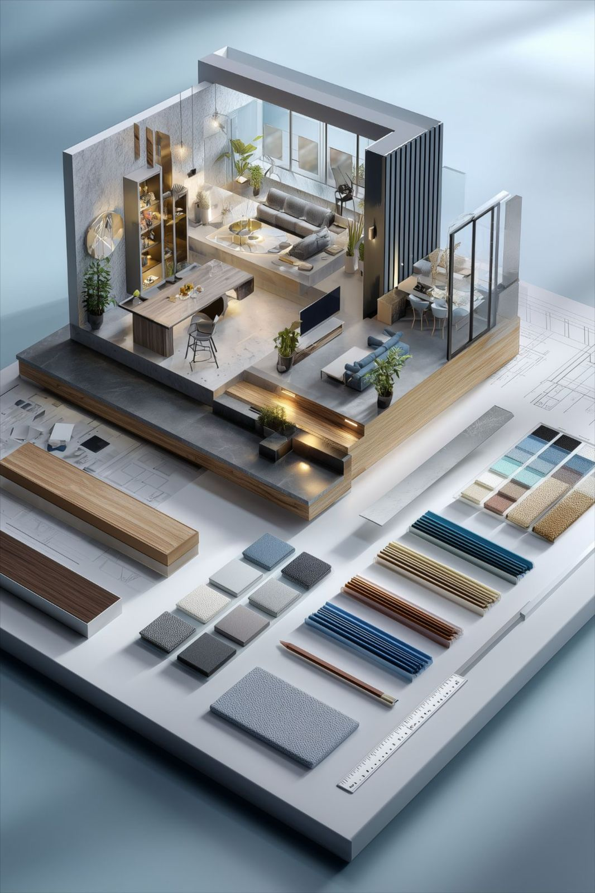

# Bootstrap Enhancement Guide for Your Website

Bootstrap is now integrated into your project! Here's how to use it to make your site more attractive.

## 1. **RESPONSIVE GRID SYSTEM** 
Bootstrap uses a 12-column grid that automatically adjusts to mobile/tablet/desktop.

### Example: Project Cards with Bootstrap Grid
Replace your custom grid with Bootstrap's responsive grid:

```html
<!-- Current Services Section -->
<section id="services" class="py-5 bg-light">
  <h2 class="text-center mb-5">Our Services</h2>
  <div class="container">
    <div class="row g-4">
      <!-- Card 1 -->
      <div class="col-md-6 col-lg-3">
        <div class="card h-100 border-0 shadow-sm">
          <div class="card-body text-center">
            <i class="fas fa-ruler text-warning fs-1 mb-3"></i>
            <h5 class="card-title">Full Design</h5>
            <p class="card-text">Concept to completion, including furniture selection and installation.</p>
          </div>
        </div>
      </div>
      <!-- Card 2 -->
      <div class="col-md-6 col-lg-3">
        <div class="card h-100 border-0 shadow-sm">
          <div class="card-body text-center">
            <i class="fas fa-eye text-warning fs-1 mb-3"></i>
            <h5 class="card-title">Consultation</h5>
            <p class="card-text">Personalized advice for your space challenges.</p>
          </div>
        </div>
      </div>
      <!-- Card 3 -->
      <div class="col-md-6 col-lg-3">
        <div class="card h-100 border-0 shadow-sm">
          <div class="card-body text-center">
            <i class="fas fa-cube text-warning fs-1 mb-3"></i>
            <h5 class="card-title">3D Rendering</h5>
            <p class="card-text">Photorealistic visualizations before we build.</p>
          </div>
        </div>
      </div>
      <!-- Card 4 -->
      <div class="col-md-6 col-lg-3">
        <div class="card h-100 border-0 shadow-sm">
          <div class="card-body text-center">
            <i class="fas fa-hammer text-warning fs-1 mb-3"></i>
            <h5 class="card-title">Renovation</h5>
            <p class="card-text">Managing contractors for seamless transformations.</p>
          </div>
        </div>
      </div>
    </div>
  </div>
</section>
```

### Bootstrap Grid Classes:
- `row` - Creates a horizontal row
- `col-*` - Column for all devices (col = equal width)
- `col-md-*` - Column for tablets and up
- `col-lg-*` - Column for desktops and up
- `g-4` - Adds spacing between columns

---

## 2. **IMPROVED NAVBAR**

Update your navigation with Bootstrap:

```html
<nav class="navbar navbar-expand-lg navbar-dark bg-dark sticky-top">
  <div class="container-fluid">
    <!-- Logo -->
    <a class="navbar-brand" href="index.html">
      
      GHAYAD
    </a>
    
    <!-- Toggle Button (Mobile) -->
    <button class="navbar-toggler" type="button" data-bs-toggle="collapse" data-bs-target="#navbarNav">
      <span class="navbar-toggler-icon"></span>
    </button>
    
    <!-- Menu Items -->
    <div class="collapse navbar-collapse" id="navbarNav">
      <ul class="navbar-nav ms-auto">
        <li class="nav-item">
          <a class="nav-link active" href="index.html">Home</a>
        </li>
        <li class="nav-item">
          <a class="nav-link" href="services.html">Services</a>
        </li>
        <li class="nav-item">
          <a class="nav-link" href="contactus.html">Contact Us</a>
        </li>
      </ul>
    </div>
  </div>
</nav>
```

**Bootstrap Navbar Classes:**
- `navbar-expand-lg` - Collapses on mobile, expands on larger screens
- `sticky-top` - Navbar stays at top when scrolling
- `navbar-toggler` - Hamburger menu for mobile
- `navbar-dark` - Dark background with light text

---

## 3. **CARDS WITH IMAGES & HOVER EFFECTS**

```html
<div class="row g-4 mt-5">
  <div class="col-md-6 col-lg-4">
    <div class="card overflow-hidden border-0 shadow-lg h-100">
      <!-- Image Container -->
      <div class="position-relative overflow-hidden bg-dark">
        
        <!-- Overlay on Hover -->
        <div class="position-absolute bottom-0 start-0 end-0 bg-dark bg-opacity-75 text-white p-3 translate-middle-y opacity-0" 
             style="transition: opacity 0.3s; height: 100%;">
          <h5>Interior Design Services</h5>
          <p class="small">Professional luxury interior design and consultation</p>
        </div>
      </div>
      
      <!-- Card Body -->
      <div class="card-body">
        <h5 class="card-title">Modern Living Spaces</h5>
        <p class="card-text">Lorem ipsum dolor sit amet...</p>
        <a href="services.html" class="btn btn-warning btn-sm">Learn More</a>
      </div>
    </div>
  </div>
</div>
```

**Key Bootstrap Classes:**
- `card` - Container for content
- `card-img-top` - Image at top of card
- `card-body` - Padding for content
- `shadow-lg` - Drop shadow effect
- `overflow-hidden` - Hides overflow content
- `position-relative`, `position-absolute` - Positioning helpers

---

## 4. **BETTER BUTTONS**

Bootstrap buttons with your brand colors:

```html
<!-- Primary Button (Gold/Bronze theme) -->
<button class="btn btn-warning btn-lg me-2">Get Started</button>

<!-- Secondary Button -->
<button class="btn btn-outline-warning btn-lg">Learn More</button>

<!-- Button Group -->
<div class="btn-group" role="group">
  <button type="button" class="btn btn-outline-dark">Design</button>
  <button type="button" class="btn btn-outline-dark">Build</button>
  <button type="button" class="btn btn-outline-dark">Support</button>
</div>
```

**Button Variants:**
- `btn-warning` - For your gold/bronze color (rgb(199, 124, 27))
- `btn-outline-warning` - Outline style
- `btn-lg` - Large button
- `btn-sm` - Small button

---

## 5. **PROFESSIONAL CONTACT FORM**

```html
<section class="py-5">
  <div class="container">
    <h2 class="text-center mb-5">Get In Touch</h2>
    
    <div class="row justify-content-center">
      <div class="col-lg-6">
        <form class="needs-validation" novalidate>
          <!-- Name Field -->
          <div class="mb-3">
            <label for="name" class="form-label">Full Name</label>
            <input type="text" class="form-control form-control-lg" id="name" required>
            <div class="invalid-feedback">Name is required</div>
          </div>
          
          <!-- Email Field -->
          <div class="mb-3">
            <label for="email" class="form-label">Email Address</label>
            <input type="email" class="form-control form-control-lg" id="email" required>
            <div class="invalid-feedback">Email is required</div>
          </div>
          
          <!-- Message Field -->
          <div class="mb-3">
            <label for="message" class="form-label">Message</label>
            <textarea class="form-control" id="message" rows="5" required></textarea>
            <div class="invalid-feedback">Message is required</div>
          </div>
          
          <!-- Submit Button -->
          <div class="d-grid">
            <button type="submit" class="btn btn-warning btn-lg">Send Message</button>
          </div>
        </form>
      </div>
    </div>
  </div>
</section>
```

**Form Classes:**
- `form-label` - Label styling
- `form-control` - Input field styling
- `form-control-lg` - Larger inputs
- `mb-3` - Margin bottom
- `d-grid` - Full-width button

---

## 6. **TESTIMONIALS SECTION**

```html
<section class="py-5 bg-light">
  <div class="container">
    <h2 class="text-center mb-5">What Our Clients Say</h2>
    
    <div class="row g-4">
      <div class="col-md-4">
        <div class="card border-0 shadow">
          <div class="card-body">
            <div class="mb-3">
              <i class="fas fa-star text-warning"></i>
              <i class="fas fa-star text-warning"></i>
              <i class="fas fa-star text-warning"></i>
              <i class="fas fa-star text-warning"></i>
              <i class="fas fa-star text-warning"></i>
            </div>
            <p class="card-text">"Exceptional design service! They transformed our space beautifully."</p>
            <h6 class="card-title">- Client Name</h6>
          </div>
        </div>
      </div>
      <!-- Repeat for more testimonials -->
    </div>
  </div>
</section>
```

---

## 7. **USEFUL BOOTSTRAP UTILITIES**

### Spacing
- `mt-5` - Margin top (large)
- `mb-4` - Margin bottom (medium)
- `p-3` - Padding all sides
- `px-4` - Padding horizontal

### Display & Visibility
- `d-flex` - Flexbox display
- `justify-content-center` - Center horizontally
- `align-items-center` - Center vertically
- `d-lg-block` - Show on large screens
- `d-lg-none` - Hide on large screens

### Colors
- `text-warning` - Gold/bronze text (matches your theme)
- `bg-dark` - Dark background
- `text-white` - White text
- `bg-light` - Light gray background

### Typography
- `fs-1` to `fs-6` - Font sizes
- `fw-bold` - Bold text
- `text-center` - Center text
- `text-uppercase` - Uppercase text

---

## 8. **QUICK CUSTOMIZATION: Match Bootstrap Colors to Your Brand**

Add this to your CSS file to customize Bootstrap for your brand:

```css
:root {
  --bs-primary: #2C1810;      /* Your brown */
  --bs-warning: #c77c1b;      /* Your gold rgb(199, 124, 27) */
  --bs-light: #EDE4E0;        /* Your light background */
  --bs-dark: #000000;         /* Your black */
}
```

---

## 9. **STEP-BY-STEP: Update Services Page**

1. Wrap your content in `<div class="container">`
2. Replace project grid with Bootstrap grid (`row` and `col-*`)
3. Add `<div class="card">` around each service/project
4. Add Bootstrap classes for styling
5. Test on mobile with DevTools (F12 → Mobile view)

---

## 10. **TEST RESPONSIVENESS**

1. Open in browser
2. Press **F12** (DevTools)
3. Click device icon (mobile view)
4. Test on different screen sizes
5. Bootstrap automatically adjusts!

---

## **Next Steps:**
1. Update services.html to use Bootstrap cards for projects
2. Improve contactus.html form with Bootstrap styling
3. Add hover effects to your project cards
4. Create a Bootstrap navbar for better mobile navigation
5. Add testimonials section
6. Play with colors and shadows!

Good luck! 🎨